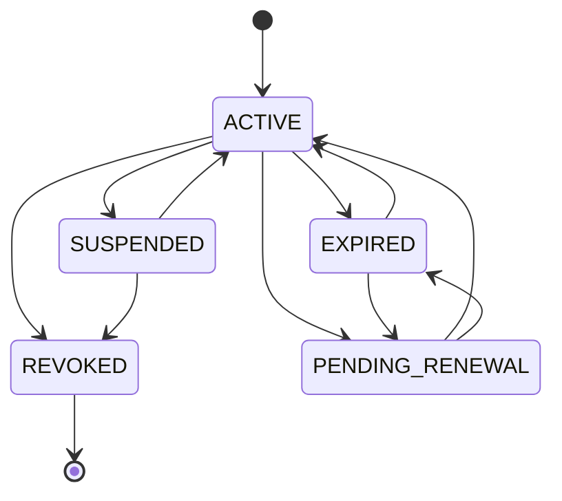
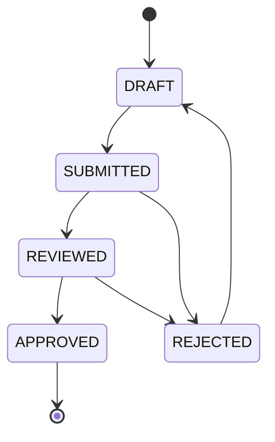
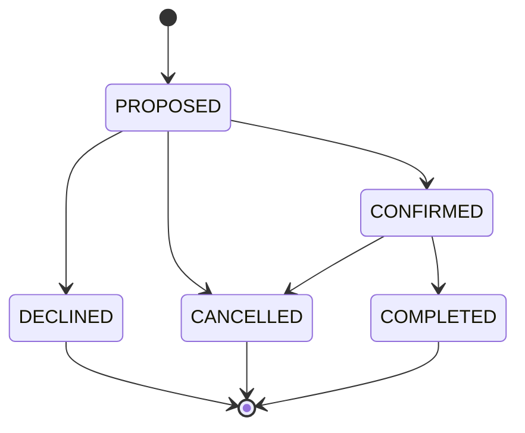

```js
import { officiatingEngine } from 'tods-competition-factory';
```

The **officiatingEngine** is a standalone state engine that manages the lifecycle of official records — certifications, evaluations, assignments, and suspensions for tournament officials (chair umpires, referees, line umpires, etc.). It operates on `OfficialRecord` documents independently from tournament records.

The engine follows the same patterns as other factory engines (state management, executionQueue with piping and rollback) but manages its own state.

---

## Core Concepts

An `OfficialRecord` is the aggregate root for a single official. It contains:

- **Certifications** — credentials with status tracking (e.g., ITF Gold Badge Chair Umpire)
- **Evaluations** — performance reviews with scored criteria and workflow status
- **Assignments** — tournament role assignments with status lifecycle
- **Suspensions** — periods during which an official is ineligible
- **Certification Requirements** — org-defined prerequisites for certification levels
- **Evaluation Policies** — structured templates defining evaluation criteria and scoring

---

## State Machines

### Certification Status



**Terminal state:** `REVOKED`

### Evaluation Status



**Terminal state:** `APPROVED`

### Assignment Status



**Terminal states:** `DECLINED`, `CANCELLED`, `COMPLETED`

---

## State Management

### reset

Clears all official records from engine state.

```js
officiatingEngine.reset();
```

### getState / setState

```js
// Get all records (deep copy)
const { officialRecords } = officiatingEngine.getState();

// Load records into engine
officiatingEngine.setState(officialRecords);
```

### setActiveOfficialRecordId / getActiveOfficialRecordId

When multiple records are loaded, set the active record for method calls that don't specify an `officialRecordId`.

```js
officiatingEngine.setActiveOfficialRecordId('rec-001');
const activeId = officiatingEngine.getActiveOfficialRecordId();
```

### setOfficialRecord / removeOfficialRecord

```js
// Upsert a single record
officiatingEngine.setOfficialRecord(officialRecord);

// Remove by ID
officiatingEngine.removeOfficialRecord('rec-001');
```

---

## Mutations

All mutations accept either `officialRecordId` (resolved from engine state) or `officialRecord` (passed directly).

### createOfficialRecord

Creates a new `OfficialRecord`, sets it in state, and makes it the active record.

```js
const { officialRecord } = officiatingEngine.createOfficialRecord({
  personId: 'person-001', // required
  organisationId: 'ITF', // optional
  officialRecordId: 'rec-001', // optional — auto-generated if absent
});
```

---

### Certifications

#### addCertification

```js
const { certification } = officiatingEngine.addCertification({
  organisationId: 'ITF', // required
  certificationFamily: 'UMPIRE', // required
  certificationLevel: 'GOLD_BADGE', // optional
  status: 'ACTIVE', // optional — defaults to ACTIVE
  validFrom: '2025-01-01', // optional
  validUntil: '2028-12-31', // optional
  documentReferences: [], // optional
  notes: '', // optional
});
```

#### modifyCertification

```js
officiatingEngine.modifyCertification({
  certificationId: 'cert-001',
  updates: { validUntil: '2029-12-31', notes: 'Renewed' },
});
```

#### removeCertification

```js
officiatingEngine.removeCertification({ certificationId: 'cert-001' });
```

#### transitionCertificationStatus

Validates the transition against `VALID_CERTIFICATION_TRANSITIONS` before applying. Records a `statusHistory` entry with timestamp.

```js
officiatingEngine.transitionCertificationStatus({
  certificationId: 'cert-001',
  toStatus: 'SUSPENDED',
  transitionedBy: 'admin-001', // optional
  reason: 'Pending investigation', // optional
});
```

---

### Evaluations

#### addEvaluation

```js
const { evaluation } = officiatingEngine.addEvaluation({
  evaluatorPersonId: 'person-002', // required — who is evaluating
  overallRating: 4.2, // required
  subjectPersonId: 'person-001', // optional
  tournamentId: 'tourn-001', // optional
  matchUpId: 'matchup-001', // optional
  evaluationDate: '2026-03-15', // optional — defaults to now
  policyName: 'ITF_CHAIR_UMPIRE_EVALUATION', // optional — links to evaluation policy
  scores: [
    // optional — criterion-level scores
    { criterionId: 'rules_knowledge', sectionId: 'pre_match', value: 4 },
  ],
  comments: 'Strong match management', // optional
});
```

#### modifyEvaluation

Only editable in `DRAFT` or `REJECTED` status.

```js
officiatingEngine.modifyEvaluation({
  evaluationId: 'eval-001',
  updates: { overallRating: 4.5, comments: 'Updated assessment' },
});
```

#### removeEvaluation

```js
officiatingEngine.removeEvaluation({ evaluationId: 'eval-001' });
```

#### transitionEvaluationStatus

When transitioning to `SUBMITTED`, validates that all required criteria scores are present (if an evaluation policy is attached).

```js
officiatingEngine.transitionEvaluationStatus({
  evaluationId: 'eval-001',
  toStatus: 'SUBMITTED',
  transitionedBy: 'eval-002', // optional
  reason: '', // optional
});
```

---

### Assignments

#### assignOfficial

```js
const { assignment } = officiatingEngine.assignOfficial({
  tournamentId: 'tourn-001', // required
  roleSubtype: 'CHAIR_UMPIRE', // required
  assignedDate: '2026-03-10', // optional
  startDate: '2026-04-01', // optional
  endDate: '2026-04-07', // optional
  assignedBy: 'admin-001', // optional
  notes: '', // optional
});
```

#### removeOfficialAssignment

```js
officiatingEngine.removeOfficialAssignment({ assignmentId: 'assign-001' });
```

#### transitionAssignmentStatus

```js
officiatingEngine.transitionAssignmentStatus({
  assignmentId: 'assign-001',
  toStatus: 'CONFIRMED',
  transitionedBy: 'admin-001', // optional
  reason: '', // optional
});
```

---

### Suspensions

#### addSuspension

```js
const { suspension } = officiatingEngine.addSuspension({
  organisationId: 'ITF', // optional
  suspensionType: 'MISCONDUCT', // optional
  suspensionNotes: 'Under review', // optional
  suspendedFrom: '2026-03-01', // optional
  suspendedUntil: '2026-06-01', // optional
});
```

#### removeSuspension

```js
officiatingEngine.removeSuspension({ suspensionId: 'susp-001' });
```

---

### Certification Requirements

#### addCertificationRequirement

Defines organisational prerequisites for a certification level. Used by `getOfficialEligibility` to check readiness.

```js
officiatingEngine.addCertificationRequirement({
  certificationFamily: 'UMPIRE',
  certificationLevel: 'GOLD_BADGE',
  organisationId: 'ITF',
  description: 'Requirements for ITF Gold Badge',
  requirements: ['Complete advanced course', 'Pass written exam'],
  prerequisiteLevels: ['SILVER_BADGE'], // optional
  minimumAssignments: 50, // optional
  minimumEvaluationScore: 4.0, // optional
  validityPeriodMonths: 48, // optional
});
```

---

### Evaluation Policies

#### addEvaluationPolicy

Attaches a structured evaluation template to the official record. Two built-in policies are provided as fixtures: `POLICY_OFFICIATING_EVALUATION_CHAIR_UMPIRE` and `POLICY_OFFICIATING_EVALUATION_REFEREE`.

```js
import { POLICY_OFFICIATING_EVALUATION_CHAIR_UMPIRE } from 'tods-competition-factory';

officiatingEngine.addEvaluationPolicy({
  evaluationPolicy: POLICY_OFFICIATING_EVALUATION_CHAIR_UMPIRE,
});
```

Policy structure:

```ts
{
  policyName: string;
  policyVersion: string;
  organisationId: string;
  officialRoleSubtype: string;
  scoringMethod: 'WEIGHTED_AVERAGE' | 'SIMPLE_AVERAGE' | 'SUM';
  passingThreshold: number;
  sections: [{
    sectionId: string;
    sectionName: string;
    weight: number;
    criteria: [{
      criterionId: string;
      criterionName: string;
      description: string;
      scoringType: 'SCALE' | 'NUMERIC' | 'CHECKLIST' | 'TEXT';
      scaleOptions?: [{ value: number; label: string }];
      required: boolean;
      weight: number;
    }]
  }]
}
```

---

## Queries

### getOfficialRecord

Returns the full `OfficialRecord` structure.

```js
const { officialRecord } = officiatingEngine.getOfficialRecord();
// or with explicit ID
const { officialRecord } = officiatingEngine.getOfficialRecord({ officialRecordId: 'rec-001' });
```

---

### getOfficialCertifications

Returns certifications with optional filtering.

```js
const { certifications } = officiatingEngine.getOfficialCertifications({
  certificationFamily: 'UMPIRE', // optional
  certificationLevel: 'GOLD_BADGE', // optional
  organisationId: 'ITF', // optional
  activeOnly: true, // optional — filters to ACTIVE status
});
```

---

### validateCertification

Checks whether a specific certification is currently valid (status, date range).

```js
const { valid, reasons, certification } = officiatingEngine.validateCertification({
  certificationId: 'cert-001',
  asOfDate: '2026-06-15', // optional — defaults to today
});
// valid: boolean
// reasons: string[] — empty when valid, populated with failure reasons otherwise
```

---

### getEvaluations

Returns all evaluations, optionally filtered.

```js
const { evaluations } = officiatingEngine.getEvaluations();
```

---

### getEvaluationSummary

Computes aggregate statistics from `APPROVED` evaluations.

```js
const { summary } = officiatingEngine.getEvaluationSummary({
  policyName: 'ITF_CHAIR_UMPIRE_EVALUATION', // optional — filter by policy
});
// summary: { evaluationCount: number, averageRating: number }
```

---

### getEvaluationTemplate

Converts an evaluation policy into a flat array of form fields for UI rendering.

```js
const { fields, evaluationPolicy } = officiatingEngine.getEvaluationTemplate({
  policyName: 'ITF_CHAIR_UMPIRE_EVALUATION', // resolves from record's policies
});
// fields: EvaluationFormField[] — flat list with sectionId, criterionId, scoringType, etc.
```

Can also accept `evaluationPolicy` directly (without an official record).

---

### getOfficialEligibility

Checks whether an official meets all requirements for a given certification.

```js
const { eligible, reasons } = officiatingEngine.getOfficialEligibility({
  certificationFamily: 'UMPIRE',
  certificationLevel: 'GOLD_BADGE', // optional
  organisationId: 'ITF', // optional
  asOfDate: '2026-06-15', // optional
});
// eligible: boolean
// reasons: string[] — e.g., ['Official has active suspension(s)', 'Insufficient completed assignments: 12/50']
```

---

### getOfficialAssignments

Returns assignments with optional filtering.

```js
const { assignments } = officiatingEngine.getOfficialAssignments({
  tournamentId: 'tourn-001', // optional
  roleSubtype: 'CHAIR_UMPIRE', // optional
  status: 'CONFIRMED', // optional
});
```

---

## Execution Queue

Batch-execute multiple directives with optional rollback on error and result piping between steps.

```js
const result = officiatingEngine.executionQueue(
  [
    {
      method: 'createOfficialRecord',
      params: { personId: 'person-001', organisationId: 'ITF' },
    },
    {
      method: 'addCertification',
      params: { organisationId: 'ITF', certificationFamily: 'UMPIRE' },
      pipe: { officialRecordId: true }, // pipes officialRecordId from previous result
    },
    {
      method: 'assignOfficial',
      params: { tournamentId: 'tourn-001', roleSubtype: 'CHAIR_UMPIRE' },
      pipe: { officialRecordId: true },
    },
  ],
  true,
); // rollbackOnError = true

// result: { success, results: [{ success, methodName, ... }, ...] }
// On error: { error, rolledBack: true }
```

**Piping**: The `pipe` object maps keys from the previous result into the current directive's params. This enables chaining operations where a later step needs an ID produced by an earlier one.

**Rollback**: When `rollbackOnError` is `true`, the engine snapshots state before execution and restores it if any directive fails.

---

## Constants

All officiating constants are available via the aggregate export:

```js
import { officiatingConstants } from 'tods-competition-factory';

const {
  // Certification status
  CERT_ACTIVE,
  CERT_EXPIRED,
  CERT_SUSPENDED,
  CERT_REVOKED,
  CERT_PENDING_RENEWAL,
  // Evaluation status
  EVAL_DRAFT,
  EVAL_SUBMITTED,
  EVAL_REVIEWED,
  EVAL_APPROVED,
  EVAL_REJECTED,
  // Assignment status
  ASSIGN_PROPOSED,
  ASSIGN_CONFIRMED,
  ASSIGN_DECLINED,
  ASSIGN_CANCELLED,
  ASSIGN_COMPLETED,
  // Transition maps
  VALID_CERTIFICATION_TRANSITIONS,
  VALID_EVALUATION_TRANSITIONS,
  VALID_ASSIGNMENT_TRANSITIONS,
  // Terminal / editable states
  CERTIFICATION_TERMINAL,
  EVALUATION_TERMINAL,
  ASSIGNMENT_TERMINAL,
  EVALUATION_EDITABLE,
  // Evaluation scale
  EVALUATION_SCALE_OPTIONS,
} = officiatingConstants;
```

---

## Types

```ts
import type {
  OfficialRecord,
  OfficialRecords,
  OfficialCertification,
  OfficialEvaluation,
  OfficialAssignment,
  OfficialSuspension,
  CertificationRequirement,
  EvaluationPolicy,
  EvaluationSection,
  EvaluationCriterion,
  EvaluationScore,
  EvaluationFormField,
  CertificationStatus,
  EvaluationStatus,
  AssignmentStatus,
  OfficialRoleSubtype,
  CertificationFamily,
  CertificationLevel,
  ScoringType,
  ScoringMethod,
  OfficiatingDirective,
  OfficiatingDirectives,
} from 'tods-competition-factory';
```

### Key Type Enums

| Type                  | Values                                                                                                            |
| --------------------- | ----------------------------------------------------------------------------------------------------------------- |
| `OfficialRoleSubtype` | `CHAIR_UMPIRE`, `LINE_UMPIRE`, `REFEREE`, `CHIEF_UMPIRE`, `DEPUTY_REFEREE`, `REVIEW_OFFICIAL`, `COURT_SUPERVISOR` |
| `CertificationFamily` | `UMPIRE`, `REFEREE`, `CHIEF_UMPIRE`, `REVIEW_OFFICIAL`                                                            |
| `CertificationLevel`  | `WHITE_BADGE`, `BRONZE_BADGE`, `SILVER_BADGE`, `GOLD_BADGE`                                                       |
| `ScoringType`         | `NUMERIC`, `SCALE`, `CHECKLIST`, `TEXT`                                                                           |
| `ScoringMethod`       | `WEIGHTED_AVERAGE`, `SIMPLE_AVERAGE`, `SUM`                                                                       |
