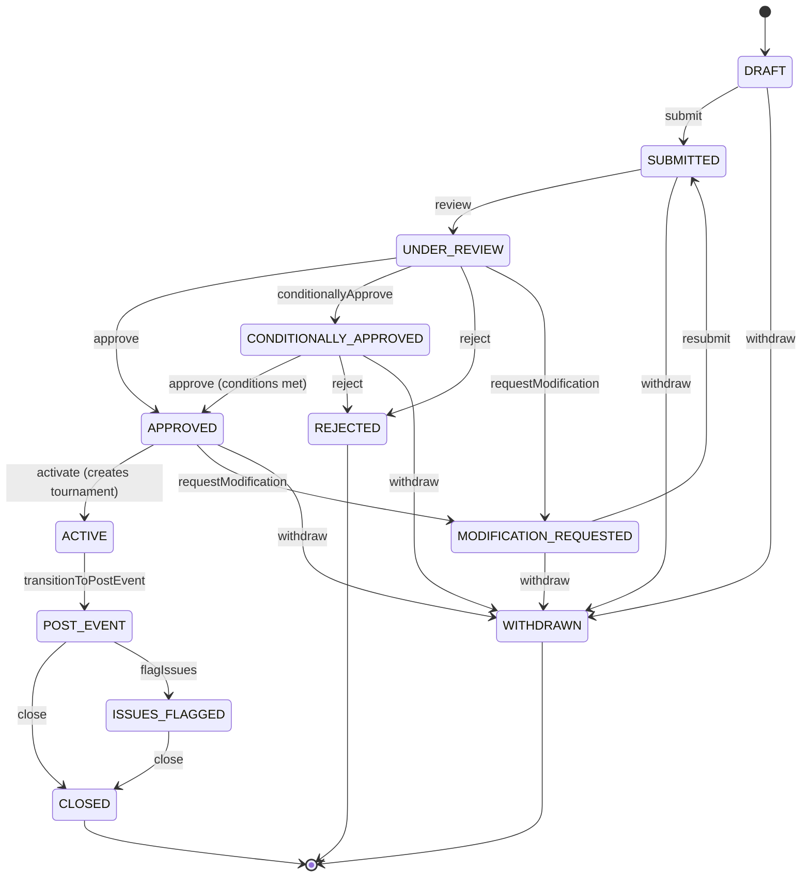

```js
import { sanctioningEngine } from 'tods-competition-factory';
```

The **sanctioningEngine** is a standalone state engine that manages the lifecycle of tournament sanctioning applications. It operates on `SanctioningRecord` documents — propositional objects that describe tournaments an organizer intends to run, subject to approval by a governing body. Once approved, a sanctioning record seeds the creation of a constrained `tournamentRecord`.

The engine follows the same patterns as the sync/async engines (state management, executionQueue with piping and rollback) but manages its own state independently from tournament records.

---

## State Machine

The sanctioning engine implements a multi-step workflow with the following statuses:



**Terminal states:** `REJECTED`, `WITHDRAWN`, `CLOSED` — no further transitions allowed.

---

## State Management

### reset

Clears all sanctioning records from engine state.

```js
sanctioningEngine.reset();
```

### getState / setState

```js
// Get all records (deep copy)
const { sanctioningRecords } = sanctioningEngine.getState();

// Load records into engine
sanctioningEngine.setState(sanctioningRecords);
```

### setActiveSanctioningId / getActiveSanctioningId

When multiple records are loaded, set the active record for method calls that don't specify a `sanctioningId`.

```js
sanctioningEngine.setActiveSanctioningId('sanc-001');
const activeId = sanctioningEngine.getActiveSanctioningId();
```

---

## Creating Records

### createSanctioningRecord

Creates a new sanctioning record in `DRAFT` status. Automatically assigns UUIDs to the record and each event proposal.

```ts
{
  sanctioningId?: string;          // optional — auto-generated if omitted
  governingBodyId: string;         // required — which body sanctions this
  applicant: Applicant;            // required — who is applying
  proposal: TournamentProposal;    // required — what tournament is proposed
  sanctioningLevel?: string;       // e.g., "W50", "Level 3"
  sanctioningPolicy?: string;      // policy name to validate against
}
```

**Returns:** `{ success, sanctioningRecord }`

```js
const result = sanctioningEngine.createSanctioningRecord({
  governingBodyId: 'usta',
  applicant: {
    organisationName: 'Cary Tennis Center',
    contactName: 'Jane Doe',
    contactEmail: 'jane@carytennis.com',
  },
  proposal: {
    tournamentName: 'Cary Open 2027',
    proposedStartDate: '2027-06-01',
    proposedEndDate: '2027-06-07',
    events: [
      { eventName: "Men's Singles", eventType: 'SINGLES', gender: 'MALE', drawSize: 32 },
      { eventName: "Women's Singles", eventType: 'SINGLES', gender: 'FEMALE', drawSize: 32 },
    ],
  },
  sanctioningLevel: 'Level 3',
});
```

---

## Proposal Editing

Proposals can only be edited when the record is in `DRAFT` or `MODIFICATION_REQUESTED` status.

### updateProposal

Updates top-level proposal fields. Does not modify the events array (use event proposal methods for that).

```js
sanctioningEngine.updateProposal({
  updates: { tournamentName: 'Cary Open Championship', surfaceCategory: 'HARD' },
});
```

### addEventProposal / removeEventProposal / updateEventProposal

```js
// Add
const { eventProposalId } = sanctioningEngine.addEventProposal({
  eventProposal: { eventName: 'Mixed Doubles', eventType: 'DOUBLES', gender: 'MIXED' },
});

// Update
sanctioningEngine.updateEventProposal({
  eventProposalId,
  updates: { drawSize: 16, matchUpFormat: 'SET3-S:6/TB7' },
});

// Remove
sanctioningEngine.removeEventProposal({ eventProposalId });
```

---

## Endorsement

Some governing bodies require a national federation endorsement before submission. The endorsement is an inline sub-workflow on the sanctioning record.

```js
// Request endorsement from national federation
sanctioningEngine.requestEndorsement({
  endorserId: 'usta-section-5',
  endorserName: 'USTA Southern Section',
});

// Federation endorses
sanctioningEngine.endorseApplication({
  endorserNotes: 'Facilities verified',
  conditions: ['Must use approved tournament software'],
});

// Or declines
sanctioningEngine.declineEndorsement({
  declineReason: 'Venue does not meet minimum court requirements',
});
```

---

## Workflow Transitions

### submitApplication

Transitions from `DRAFT` to `SUBMITTED`. If a `sanctioningPolicy` is provided with `requireEndorsement: true`, submission is blocked unless the endorsement status is `ENDORSED` or `NOT_REQUIRED`.

The policy is snapshot'd onto the record at submission time — all subsequent validation uses the snapshot.

```js
sanctioningEngine.submitApplication({
  sanctioningPolicy: POLICY_SANCTIONING_USTA,
  submittedBy: 'jane@carytennis.com',
});
```

### reviewApplication / approveApplication / rejectApplication

```js
// Begin review
sanctioningEngine.reviewApplication({
  reviewer: { reviewerId: 'rev-001', reviewerName: 'John Reviewer' },
});

// Approve
sanctioningEngine.approveApplication({ approvedBy: 'John Reviewer' });

// Or reject
sanctioningEngine.rejectApplication({
  rejectedBy: 'John Reviewer',
  reason: 'Insufficient facilities for requested level',
});
```

### conditionallyApprove / meetCondition

```js
sanctioningEngine.conditionallyApprove({
  conditions: [{ description: 'Submit insurance certificate' }, { description: 'Confirm medical plan' }],
});

// Later, meet each condition
const record = sanctioningEngine.getSanctioningRecord().sanctioningRecord;
for (const condition of record.conditions) {
  const { allConditionsMet } = sanctioningEngine.meetCondition({
    conditionId: condition.conditionId,
  });
  if (allConditionsMet) {
    sanctioningEngine.approveApplication({}); // now fully approved
  }
}
```

### requestModification / withdrawApplication

```js
sanctioningEngine.requestModification({
  requestedBy: 'Reviewer',
  note: 'Please increase draw size to 64',
});

// Applicant modifies and resubmits
sanctioningEngine.updateProposal({ updates: { ... } });
sanctioningEngine.submitApplication({ sanctioningPolicy });
```

---

## Tournament Generation

### activateFromSanctioning

When a sanctioning record is `APPROVED`, this method generates a constrained `tournamentRecord` and transitions the sanctioning to `ACTIVE`.

The generated tournament carries:

- Events with `allowedDrawTypes` from event proposals
- `processCodes: ['SANCTIONED']`
- `parentOrganisationId` from the governing body
- Sanctioning ID stored as an extension
- A compliance checklist generated from the policy's `postEventRequirements`

```js
const { tournamentRecord } = sanctioningEngine.activateFromSanctioning({
  sanctioningPolicy: POLICY_SANCTIONING_ITF,
});

// tournamentRecord is ready to load into tournamentEngine
tournamentEngine.setState(tournamentRecord);
```

---

## Amendments

After approval, modifications follow an amendment sub-workflow rather than full re-submission.

```js
// Propose an amendment
const { severity, autoApproved } = sanctioningEngine.proposeAmendment({
  changes: [{ field: 'tournamentName', previousValue: 'Old Name', proposedValue: 'New Name', changeType: 'MODIFIED' }],
  sanctioningPolicy,
});
// Minor changes are auto-approved; substantial changes need review

// Review a substantial amendment
sanctioningEngine.reviewAmendment({
  amendmentId: '...',
  approved: true,
  reviewerNotes: 'Date change approved',
});
```

**Severity classification** is policy-driven via `amendmentRules.substantialChangeFields`. Fields matching those patterns (including wildcards like `events.*.drawSize`) are classified as `SUBSTANTIAL`.

---

## Post-Event Compliance

After a tournament completes, the sanctioning record tracks compliance items.

```js
// Transition to post-event
sanctioningEngine.transitionToPostEvent({});

// Submit compliance items
sanctioningEngine.submitComplianceItem({
  itemId: '...',
  value: { fileUrl: 'https://results.example.com' },
});

// Verify items
const { allCompliant } = sanctioningEngine.verifyComplianceItem({ itemId: '...' });

// Close when compliant
if (allCompliant) {
  sanctioningEngine.closeApplication({});
}
```

---

## Queries

### getSanctioningRecord

Returns a deep copy of the active sanctioning record.

### getAvailableTransitions

Returns valid status transitions for the current record.

### getStatusHistory

Returns the full status transition history.

### getCompleteness

Returns a completeness score (0-100%) with missing fields. Optionally accepts a `sanctioningPolicy` to include policy-driven field requirements.

```js
const { completeness } = sanctioningEngine.getCompleteness({ sanctioningPolicy });
// { score: 85, totalFields: 14, completedFields: 12, missingFields: [...] }
```

### getEligibleTiers

Returns which policy tiers the current proposal is eligible for, with reasons for ineligibility.

```js
const { eligibleTiers, tierEligibilities } = sanctioningEngine.getEligibleTiers({
  sanctioningPolicy: POLICY_SANCTIONING_USTA,
});
```

### validateProposal

Validates the proposal against a sanctioning policy and optional tier. Returns structured issues with severity (`error` or `warning`).

```js
const { valid, errors, warnings, issues } = sanctioningEngine.validateProposal({
  sanctioningPolicy,
  sanctioningTier: 'Level 3',
});
```

### getCalendarConflicts

Detects scheduling conflicts with existing sanctioned events. Requires injected `calendarContext` (the engine doesn't fetch data).

```js
const { conflicts, hasConflicts } = sanctioningEngine.getCalendarConflicts({
  calendarContext: {
    existingEvents: [...],  // provided by server
    calendarRules: { proximityWeeks: 2, maxEventsPerWeek: 5 },
  },
});
```

---

## executionQueue

Batch execution with piping and rollback, identical to the tournament engine pattern.

```js
const result = sanctioningEngine.executionQueue([
  { method: 'createSanctioningRecord', params: { ... } },
  { method: 'submitApplication', params: { sanctioningPolicy } },
  { method: 'reviewApplication', params: {} },
  { method: 'approveApplication', params: {} },
  { method: 'activateFromSanctioning', params: { sanctioningPolicy } },
], true); // rollbackOnError
```

---

## Policy Fixtures

Three sanctioning policies are included as fixtures:

| Policy                       | Governing Body | Tiers                                      |
| ---------------------------- | -------------- | ------------------------------------------ |
| `POLICY_SANCTIONING_GENERIC` | Generic        | Level 1, 2, 3                              |
| `POLICY_SANCTIONING_ITF`     | ITF            | M15/W15, M25/W25, W35, W50, W75, W100      |
| `POLICY_SANCTIONING_USTA`    | USTA           | Level 7 (local) through Level 1 (national) |

Each policy defines: tier constraints (draw types, sizes, formats, prize money, courts, officials), personnel rules, calendar rules, amendment rules, and post-event compliance requirements.

```js
import { POLICY_SANCTIONING_ITF } from 'tods-competition-factory/fixtures/policies/POLICY_SANCTIONING_ITF';
```
